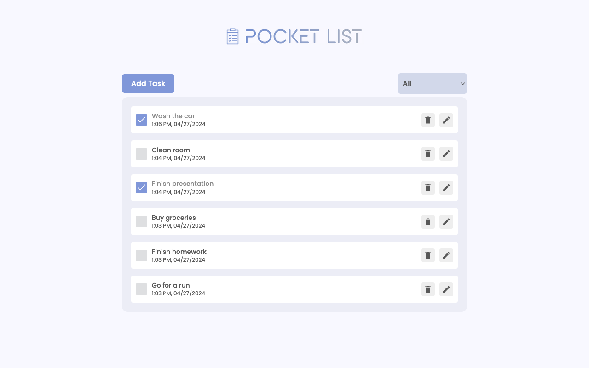

# Pocket List.

- Pocket List is a Todo Application built with React.js, Redux, and Framer Motion. It offers complete CRUD functionality, allowing users to create, read, update, and delete tasks. With a focus on simplicity and usability, the application features dynamic animations powered by Framer Motion, enhancing the user experience.

## Live Demo.

**live demo: [Here]()**

## Features

- Todo Creation: Easily create new tasks by entering the task description and pressing the "Add" button.

- Task Management: Efficiently manage tasks with options to mark tasks as completed, edit task details, or delete tasks as needed.

- Task Filtering: Quickly filter tasks based on their completion status (completed, active) to focus on specific subsets of tasks.

- Responsive Design: Enjoy seamless usability across various devices and screen sizes, ensuring a consistent and optimized experience for all users.

## Built With:

- React.js
- Redux
- Framer Motion
- Semantic HTML5 Markup
- CSS Modules
- SCSS (Sass)
- Axios
- Responsive Design with CSS Flexbox
